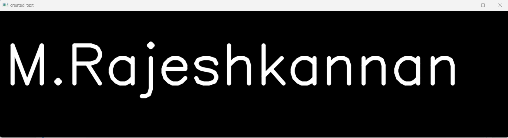
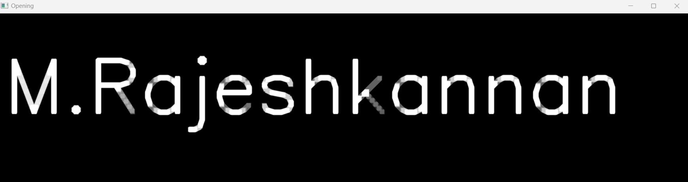

# Opening-and-Closing

## Aim
To implement Opening and Closing using Python and OpenCV.

## Software Required
1. Anaconda - Python 3.7
2. OpenCV
## Algorithm:
### Step1:
Import the necessary packages

### Step 2:
Read the image

### Step 3:
Create the structuring element

### Step 4:
Use Opening operation

### Step 5:
Use Closing Operation

### Step 6:
Display all the output images

 
## Program:


 Import the necessary packages
```
import cv2
import numpy as np
```
 Create the Text using cv2.putText

 ```
img= np.zeros((350,1400),dtype ='uint8')
font = cv2.FONT_HERSHEY_SIMPLEX
cv2.putText(img,'M.Rajeshkannan',(15,200),font,5,(255),10,cv2.LINE_AA)
cv2.imshow('created_text',img)
cv2.waitKey(0)
cv2.destroyAllWindows()
```

Create the structuring element
```
struct_ele= np.ones((9,9),np.uint8)
```

Use Opening operation
```
opening = cv2.morphologyEx(img,cv2.MORPH_OPEN,struct_ele)
cv2.imshow('Opening',opening)
cv2.waitKey(0)
cv2.destroyAllWindows()
```
Use Closing Operation
```
closing = cv2.morphologyEx(img,cv2.MORPH_CLOSE,struct_ele)
cv2.imshow('Closing',closing)
cv2.waitKey(0)
cv2.destroyAllWindows()

```
## Output:

### Display the input Image


### Display the result of Opening


### Display the result of Closing


## Result
Thus the Opening and Closing operation is used in the image using python and OpenCV.